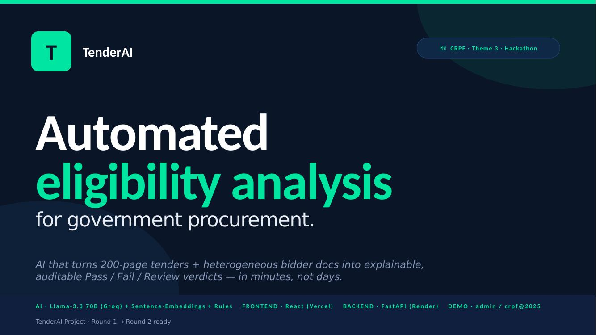
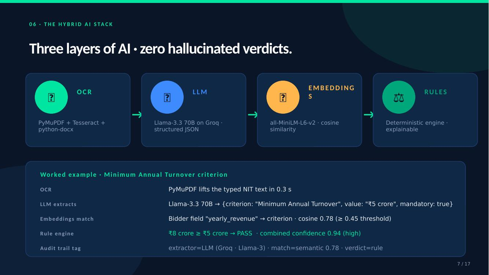
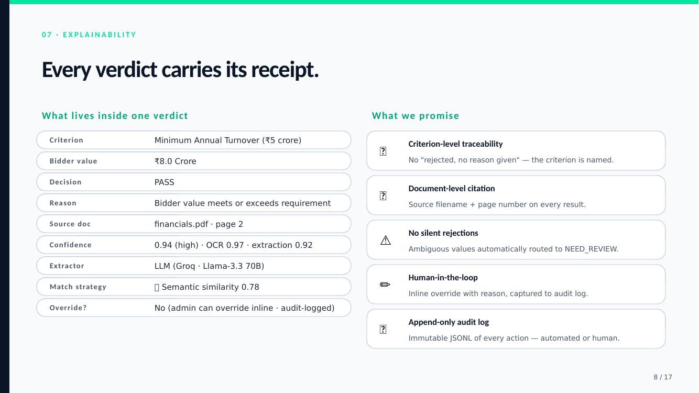

# TenderAI — Automated Tender Evaluation & Bidder Eligibility Analysis

AI-powered platform for government tender evaluation and bidder eligibility analysis, tuned for CRPF-style procurement workflows and audit-heavy public-sector review.

## Features

- **Document Processing**: Upload PDF, image, and DOCX tender or bidder documents; extract native PDF text first and fall back to Tesseract OCR for scans.
- **Hybrid AI Extraction**: Use Groq/Llama-3 for tender criteria and bidder facts, with deterministic regex as a recall and fallback layer.
- **Semantic Matching**: Match LLM-extracted or differently worded fields with sentence embeddings before falling back to manual review.
- **Source-Aware Confidence**: Score regex, LLM, and semantic matches with different weighting so review routing is calibrated by extraction source.
- **Explainable Decisions**: Every PASS / FAIL / NEED_REVIEW includes criterion, bidder value, document, page, confidence, match strategy, source, and reasoning/evidence.
- **Manual Override**: Admin reviewers can override decisions with an audit trail.
- **Report Generation**: Download JSON and PDF reports that include extraction source, semantic-match metadata, and LLM reasoning/evidence.
- **Audit Log**: Track upload, extraction, evaluation, override, and report actions.

## Government Procurement Context

TenderAI is shaped around Indian government procurement review patterns:

- **GFR-style transparency**: preserve criteria, evidence, source document, confidence, and override reasons for auditability.
- **CVC-style fairness**: make automated decisions explainable and consistently routed to manual review when evidence is weak.
- **CRPF / NIT workflows**: support common eligibility checks such as turnover, similar work experience, GST, PAN, ISO, EPFO, blacklisting declarations, and EMD-related facts.

This is a decision-support tool. Final procurement decisions should remain with authorized officials.

## Screenshots

Existing QA screenshots are included at the repo root:





## Architecture

```text
React Frontend (Vite)
  - Bidder portal
  - Admin dashboard
  - Criteria, evaluation, reports, audit log
        |
        v
FastAPI Backend
  - OCR Service
      Native PDF text, Tesseract OCR, DOCX text
      Produces raw full_text plus page-aware llm_text payload
  - Hybrid Extractors
      llm_extractor.py (Groq/Llama-3)
      tender_extractor.py and bidder_extractor.py regex fallback/merge
  - Matching Engine
      Canonical field mapping
      semantic_matcher.py embedding fallback
      source-aware confidence_scorer.py
  - Reports
      JSON/PDF with extraction source, evidence, LLM reasoning, audit trail
  - Storage
      Local JSON sessions, extractions, evaluations, reports
```

## Prerequisites

- **Python 3.10+**
- **Node.js 18+**
- **Tesseract OCR** for scanned documents
- Optional: **Groq API key** for LLM extraction

### Install Tesseract on macOS

```bash
brew install tesseract
```

## Configuration

Backend environment variables:

```bash
GROQ_API_KEY=your_groq_key
GROQ_MODEL=llama-3.3-70b-versatile
USE_LLM_EXTRACTOR=1
LLM_TIMEOUT=30
USE_SEMANTIC_MATCHER=1
SEMANTIC_MODEL=sentence-transformers/all-MiniLM-L6-v2
SEMANTIC_THRESHOLD=0.45
```

`LLM_API_KEY` and `LLM_MODEL` are also supported as provider-neutral aliases.

Frontend demo credentials can be overridden with:

```bash
VITE_ADMIN_USERNAME=admin
VITE_ADMIN_PASSWORD=crpf@2025
```

Default admin demo login:

- Username: `admin`
- Password: `crpf@2025`

The bidder portal is public and does not require login.

## Quick Start

### 1. Backend Setup

```bash
cd backend
python -m venv venv
source venv/bin/activate
pip install -r requirements.txt
```

### 2. Generate Sample Data

```bash
cd backend
python -m sample_data.generate_samples
```

### 3. Start Backend Server

```bash
cd backend
uvicorn main:app --reload --host 0.0.0.0 --port 8000
```

API docs: http://localhost:8000/docs

### 4. Frontend Setup

```bash
cd frontend
npm install
npm run dev
```

Frontend: http://localhost:5173

## Demo Workflow

1. Log in to the admin dashboard with `admin` / `crpf@2025`.
2. Upload `backend/sample_data/generated/sample_tender_crpf.pdf`.
3. Extract criteria. With `GROQ_API_KEY` set, LLM extraction runs first; regex fills gaps.
4. Upload bidder documents:
   - `bidder_techvision_solutions.pdf` — expected eligible
   - `bidder_bharat_infra.pdf` — expected not eligible
   - `bidder_securenet_systems.pdf` — expected needs review
5. Extract bidder data and evaluate all bidders.
6. Inspect confidence, source, semantic matches, evidence, and audit log.
7. Download JSON or PDF reports.

## API Endpoints

| Method | Endpoint | Description |
|--------|----------|-------------|
| GET | `/health` | Health plus LLM and semantic matcher status |
| POST | `/api/upload_tender` | Upload tender document |
| POST | `/api/extract_criteria/{id}` | Extract tender criteria via LLM + regex fallback |
| GET | `/api/tender/{id}` | Get tender info |
| POST | `/api/upload_bidder_docs/{id}` | Upload bidder documents |
| POST | `/api/extract_bidder_data/{id}/{bid}` | Extract bidder facts via LLM + regex merge |
| GET | `/api/bidders/{id}` | List bidders |
| POST | `/api/evaluate_bidders/{id}` | Run canonical + semantic evaluation |
| GET | `/api/evaluation/{id}` | Get evaluation results |
| POST | `/api/override/{id}/{bid}` | Override a decision |
| GET | `/api/report/{id}/json` | Download JSON report |
| GET | `/api/report/{id}/pdf` | Download PDF report |
| GET | `/api/audit_log/{id}` | Get audit log |

## Tech Stack

- **Frontend**: React 18 + Vite 5
- **Backend**: FastAPI + Uvicorn
- **OCR**: PyMuPDF + Tesseract + python-docx
- **LLM Extraction**: Groq SDK with Llama-3 compatible JSON mode
- **Semantic Matching**: sentence-transformers
- **Reports**: ReportLab
- **Storage**: Local filesystem + JSON

## License

MIT
